# AWS Basic Network via Terraform Cloud SNOW Integration

A terraform project to build an AWS basic network for use with TFC ServiceNOW integration. The purpose of the tutorial is to build a custom ServiceNow catalog item that can be used to order an AWS VPC with some public and private networks.

## Overview

At a high level, the steps that would need to be performed by the Terraform Cloud ServiceNOW application so that a ServiceNOW user can request an AWS Network would be:

* Create a Terraform Cloud workspace, connected to an appropriate VCS repository.
* Set variables and their values in the Terraform Cloud workspace.
* Trigger a run in the workspace.
* Approve the plan for that run.

This means that in ServiceNOW we need to create a Flow that implements those steps and a Catalog Item that executes this Flow.

## Prerequisites

This guide assumes that you have already installed the Terraform ServiceNOW application and that you are aware of how to configure VCS repositories for it to use.

To use this project you need to:

* Have ServiceNow instance.
* Have Installed on the instance the Terraform Cloud ServiceNow application.
* Fork this repository or have a repository with appropriate Terraform configuration added to the Terraform ServiceNOW application. Help on that can be found in the [documentation](https://www.terraform.io/docs/cloud/integrations/service-now/service-catalog.html#configure-vcs-repositories). The guide assumes you are using a fork/copy of this repo.

Take a look at the Terraform configuration in the repo so that you will have a general idea what variables it needs set and what it will do.

## ServiceNOW configuration

 The configuration needed to create a Flow and a Catalog Item is preformed in the ServiceNOW studio and the Flow editor.

To open the ServiceNOW Studio search for `studio` in the menus on the left side. When it is opened it will prompt you to select an application - choose the Terraform application.

### Create a new Variable Set

The variable set will contain all the variables that need to be passed to the ServiceNOW flow for it to use. In our case it will contain the Terraform and Environment variables that would need to be set in the Terraform Cloud workspace created by ServiceNOW. It is recommended to read the section to the end before proceeding with the steps for creating the variables.

* In the ServiceNOW Studio click on `Create New` item, choose Variable Set type and click on `Create`.

  

* Choose a `Single-Row Variable Set`.

  

* Fill out the `Title`, `Internal name` and optionally the `Description` fields and click on `Submit`.
  
  

### Add Variables to the Variable Set

At this point there is a Variable Set that will hold the variables that ServiceNOW will add to the Terraform Cloud workspace. To add the  variables to the variable set:

* Open the `AWS Basic Network` variable set we created - find it on the left-side menu under `Service Catalog > Variable Sets > AWS Basic Network`.
* Click on the `New` button under the `Variables` tab.
  
  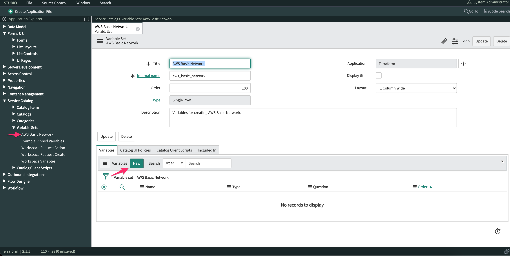

* Fill out the `Question` and `Name` fields.

  

  * The `Question` will contain what the user will see in the ServiceNOW catalog when asked to provide a value.
  * The `Name` must be derived from the actual terraform variable for which the value is being set as described [here](https://www.terraform.io/docs/cloud/integrations/service-now/developer-reference.html#terraform-variables-and-servicenow-variable-sets). To provide a value for an HCL Terraform variable the prefix `tf_var_hcl_` must be used.
  * (Optional) Can also provide an example value for variables in the `Example Text` field. The text set there will be displayed to the user as an example variable value when they are ordering the Catalog Item. This is useful when the variable is a more complex `HCL` string e.g. the value for the `private_subnet_cidrs` would be something like `[{cidr = "172.30.2.0/24", az_index = 0}, {cidr = "172.30.3.0/24", az_index = 1}]`.
* Click on the `Submit` button to finish adding the variable.
  
The following variables must be set by following the steps above:

| Terraform Variable | ServiceNOW Variable Name | ServiceNow Variable Question |
|--------------------|--------------------------|------------------------------|
| `vpc_cidr_block` | `tf_var_vpc_cidr_block` | VPC CIDR Block |
| `public_subnet_cidrs` | `tf_var_hcl_public_subnet_cidrs` | Public Subnet CIDRs |
| `private_subnet_cidrs` | `tf_var_hcl_private_subnet_cidrs` | Private Subnet CIDRs |
| `common_tags` | `tf_var_hcl_common_tags` | Common Tags |
| `name_prefix` | `tf_var_name_prefix` | Name Prefix |

| Environment Variable | ServiceNOW Variable Name | ServiceNow Variable Question |
|--------------------|--------------------------|------------------------------|
| `AWS_ACCESS_KEY_ID` | `tf_env_AWS_ACCESS_KEY_ID` | AWS ACCESS KEY ID |
| `AWS_SECRET_ACCESS_KEY` | `sensitive_tf_env_AWS_SECRET_ACCESS_KEY` | AWS SECRET ACCESS KEY |
| `AWS_DEFAULT_REGION` | `tf_env_AWS_DEFAULT_REGION` | AWS DEFAULT REGION |
| `AWS_SESSION_TOKEN` | `sensitive_tf_env_AWS_SESSION_TOKEN` | AWS SESSION TOKEN |

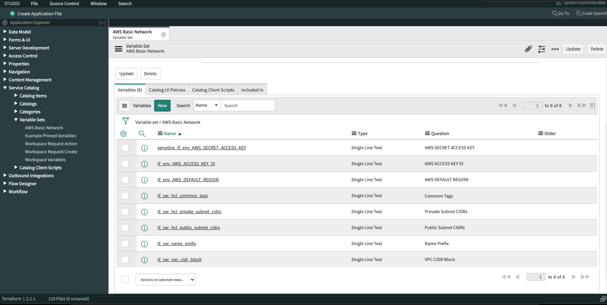

### Create New Catalog Item

The next step is to create the new Catalog Item through which the users will request the "Basic AWS Network".

* Create a new file in the ServiceNOW studio of type Catalog Item.
  
  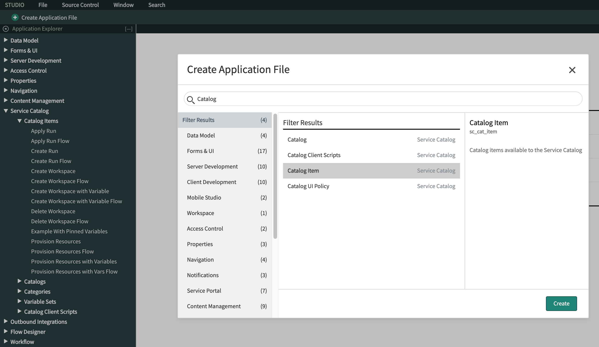

* Inside the New Catalog Item window:
  *  Populate the `Name` field.
  *  Select `Terraform Catalogs` in the `Catalogs` section.
  *  Select `Terraform Resources` in the `Category` section.

  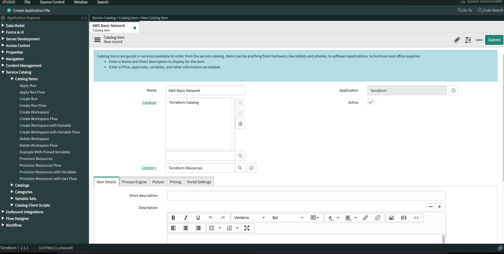

* Click `Submit` to save the new catalog.

### Add Variable Sets to the Catalog Item

Next we need to add variable sets to the Catalog Item. To do so:

* Open the created `AWS Basic Network` catalog item. After clicking `Submit` on the previous step it should already be opened.
* Scroll to the bottom.
* Choose `Variable Sets` tab.
* Click on `Edit`.
  
  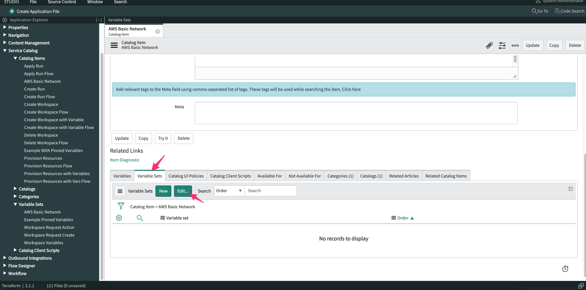

* Select the `AWS Basic Network` and the `Workspace Request Create` variable sets and `Save` the selection.

  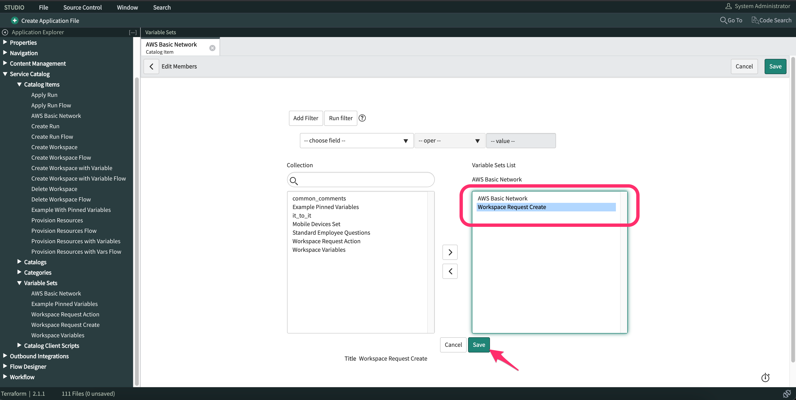

* At this point you should see the selected variable sets in the `Variable Sets` tab.

**Note:** The `Workspace Request Create` is provided by the Terraform application itself. It allows the selection of the Terraform Cloud workspace VCS repository from the repositories configured in the Terraform ServiceNOW application. Realistically, in this case only a single repository would be used for every order and so it does not make much sense to present the user with a choice and the repository choice should be hardcoded. Still, for the purpose of this guide selecting it when ordering the Catalog Item will do.

### Create a ServiceNOW Action

The service now action in our case is essentially a JavaScript invocation. The JavaScript script will make calls to the Terraform Cloud API to create the workspace and set variables for it. We are going to copy one of the predefined actions that come with the Terraform ServiceNOW application and modify it.

* In the ServiceNOW studio go to `Flow Designer > Actions` and click on the `Terraform Create Workspace with Var` action. This will open the example action in the ServiceNOW Flow Designer.

  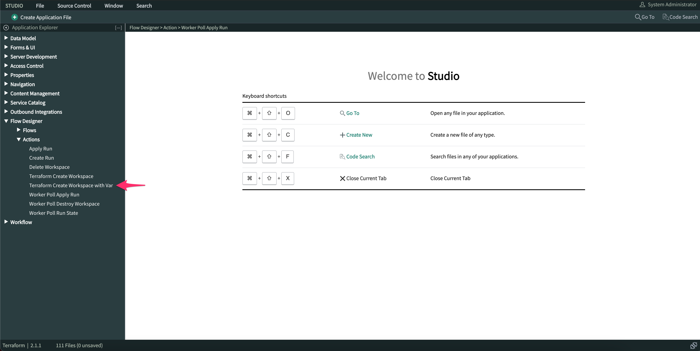

* In the new window open the menu on the top right and click on `Copy action`.

  

* Provide a name for the new Action e.g. `Create Workspace AWS Basic Network` and click on `Copy`. This will open the copied action in a new tab within the Flow Designer.
  
  

* In the `Inputs` section of the action (sections are displayed on the left) remove all the inputs that contain `tf_var` or `tf_env`. You should be left with exactly the `Inputs` displayed on the screenshot below.
  
  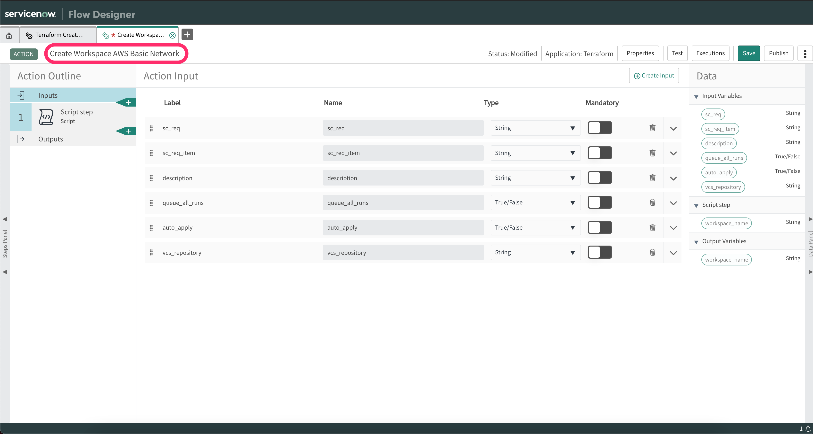

* Go to the `Script` section of the action and again remove all `Input Variables` that contain `tf_var` or `tf_env`. You should be left with exactly the `Input Variables` displayed on the screenshot below.

  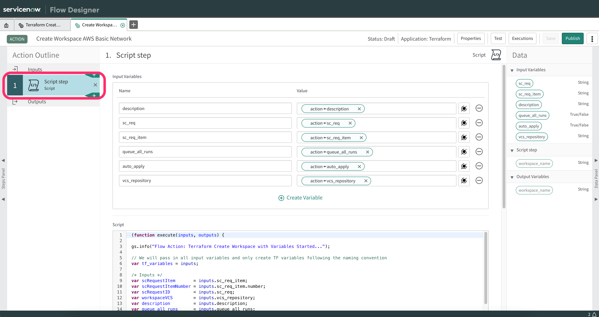

* Go back to the `Inputs` section and create new inputs for all the variables that we will need to set for the workspace. For each variable its `Label` should be set the same as the name of the variable in the Variable set, while the `Name` will be automatically generated.

  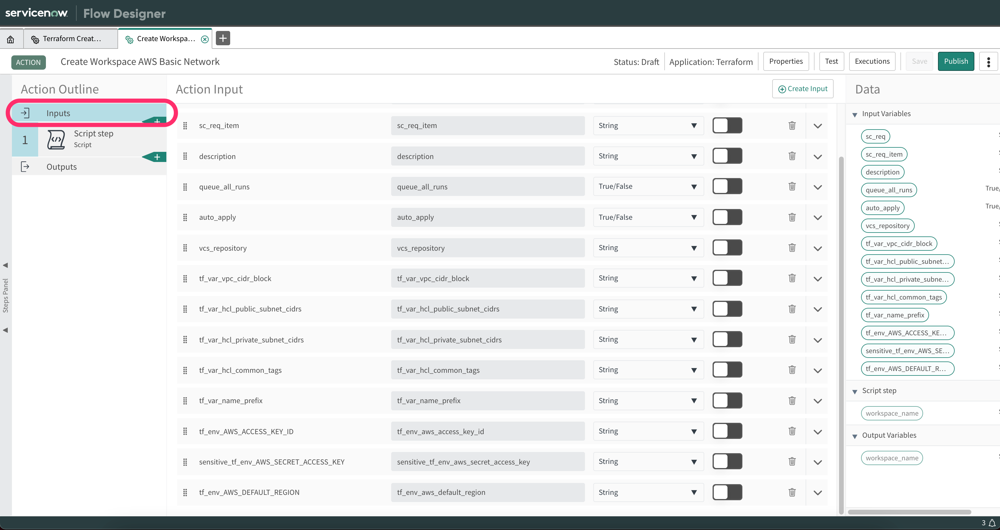

* Go to the `Script` section and add an Input Variable for each of the workspace variables by using the `Create Variable` button. Pass as value the appropriate Input defined in the `Inputs` section. To do that drag and dorp the appropriate input from the section on the right to the value field. Names of the `Input Variables` must be the same as the names in the Variable set - that is they must follow the naming convention defined in the Terraform Cloud [documentation](https://www.terraform.io/docs/cloud/integrations/service-now/developer-reference.html#terraform-variables-and-servicenow-variable-sets).
  
  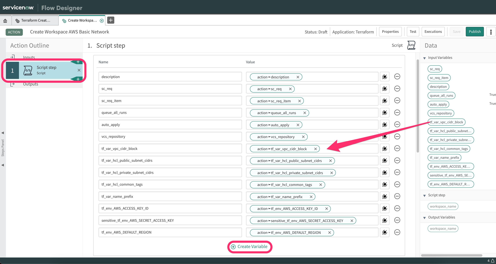

* To save the action click the `Save` and then `Publish` buttons at the top right. After you do that the action status should look like:

  

### Create a ServiceNOW Flow

The next step is to create a ServiceNOW Flow that will define the sequence of actions needed to create the `Basic AWS Network`:

  1. Get the variable values provided by the user when making the request via the Service Catalog.
  2. Create a Terraform Cloud workspace, configure it and create and set the variables in it.
  3. Trigger a run for the workspace.

To do this:

* Go to the Home section in the Flow Designer and find and click on the `Create Workspace with Var` flow. Mind that this is a `flow` and not the `action` with the similar name we copied earlier.
  
  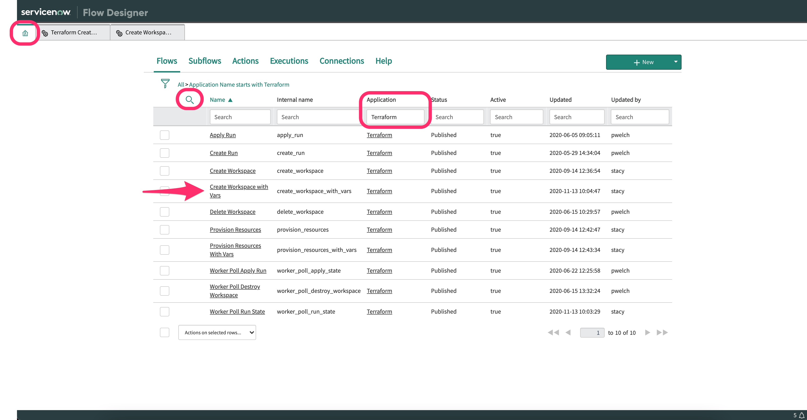

* Copy the `Create Workspace with Var` flow in the same way you copied the action earlier. You can name the new flow `Create Workspace AWS Basic Network` for example. When done you should have the new flow opened like this:
  
  

* Expand the 1st action - `Get Catalog Variables`.
* Modify the `Template Catalog Item [Catalog Item]` field by selecting the service catalog item we created in the beginning - `AWS Basic Network`.
* Select all the suggested variables by moving them the the right column and click on `Done`.

  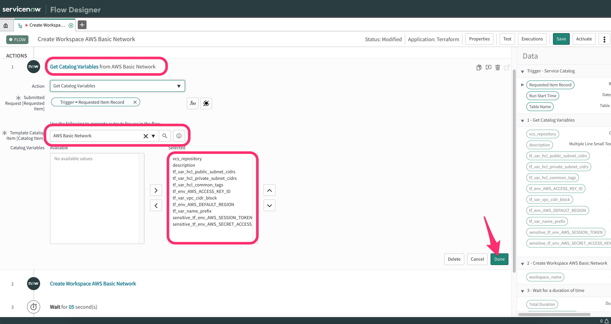

* Expand and delete the 2nd action - `Terraform Create Workspace with Var`.
  
  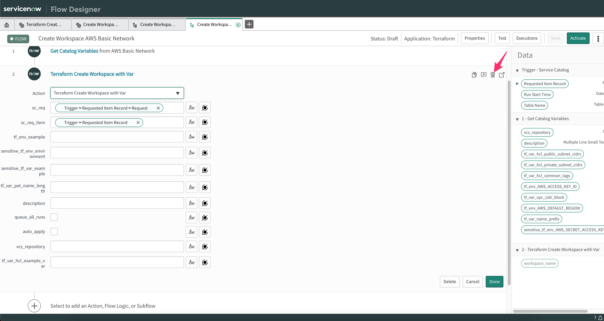

* Add a new Action - the `Create Workspace AWS Basic Network` action that we created earlier.
  
  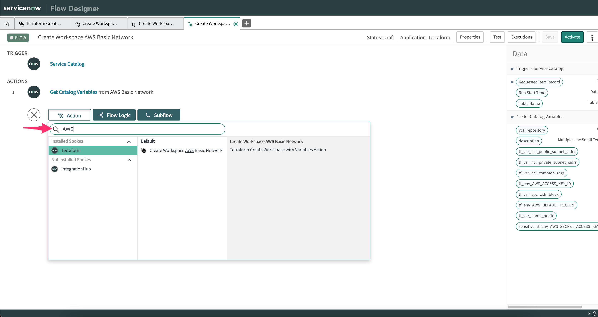

* Configure the action by dragging and dropping the items e.i. variables, request item, shown on the right to the appropriate value fields for the action inputs. Make sure that `queue_all_runs` is not ticked and that `auto_apply` is.

  **Note:** To get to the `sc_req` input you will need to expand the `Requested Item Record` on the right and find the nested `Request` under it.

  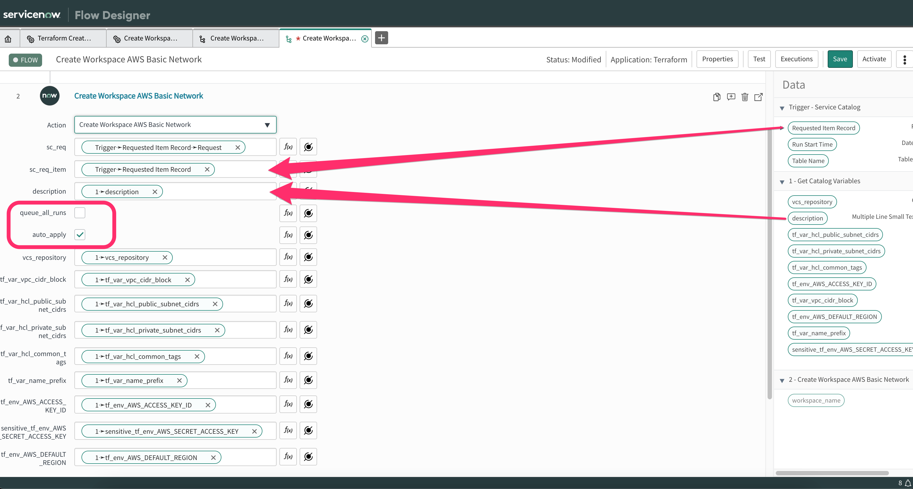

* Add a 3rd step - a 5 second wait to give Terraform Cloud time to create everything.

  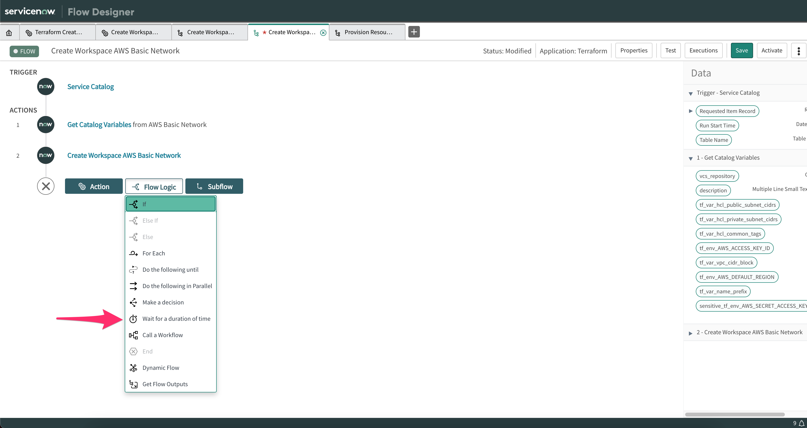

* Add a 4th step - `Create Terraform Run` action. This action comes as part of the Terraform ServiceNOW application. Configure the inputs for it in the same way that you did for the action in the 2nd step. Note that the value for the `workspace_name` input comes from the value of the 2nd action output.
  
  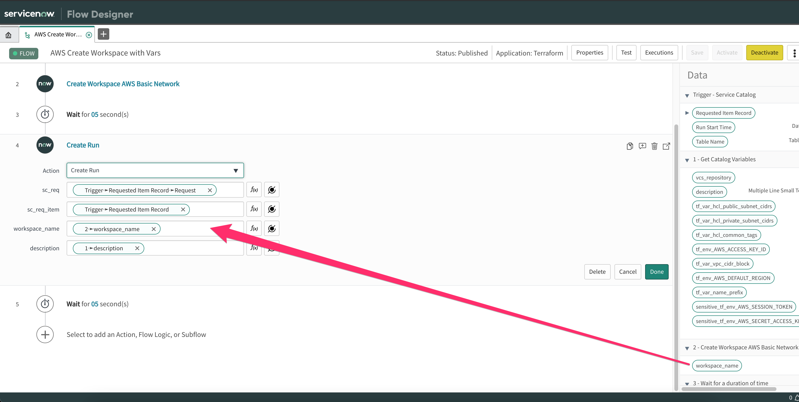

* Add another 5 seconds wait as a 5th step.
* `Save` and then `Activate` the Flow using the buttons on the top right. After this the flow overview should look like:

  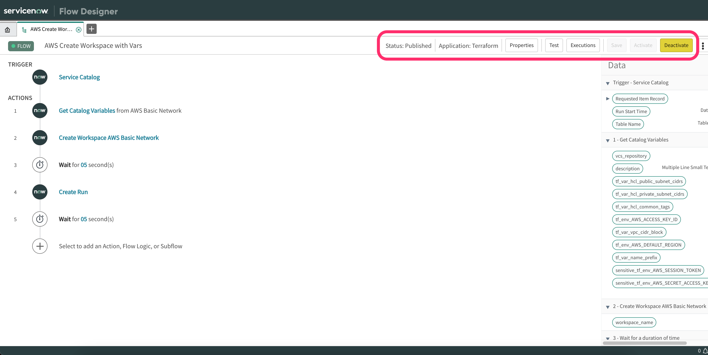

* You can close the Flow Designer window.

### Set the Catalog Item to Use the New Flow

The last step of the configuration is to set the Catalog Item we created in the beginning to use the new Flow.

* Go to the ServiceNOW Studio (not the Flow Designer) and open the catalog item - `Service Catalog` > `Catalog Items` > `Basic AWS Network`.
* In the `Process Engine` tab set the `Flow` field to the flow we created previously.

  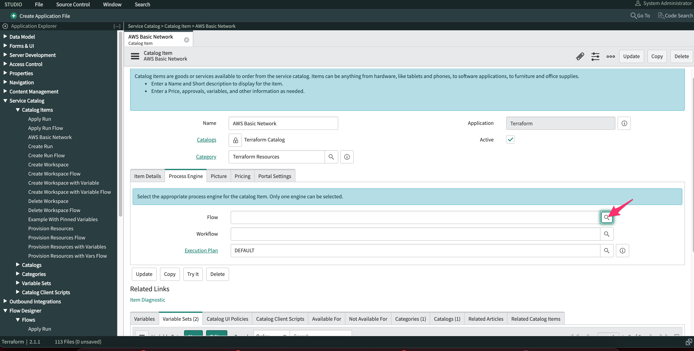

  

* Click on the `Update` button to save the changes.

### Testing If It All Works

At this point the Catalog Item `AWS Basic Network` should be fully configured and upon request be able to create a workspace in Terraform Cloud, set variables for it and trigger a run.

To test it make an order via the Service Catalog.

* In ServiceNOW go to the `Service Catalog` > `Catalogs` and select the Terraform catalog. This catalog should have been added as part of installing and initial setup of the Terraform ServiceNOW application.
* Inside the Terraform catalog select the Catalog Item that we added `Basic AWS Network`.
* Fill out the variable values. 
  * Make sure to select the appropriate VCS repository if you have configured more than one.
  * For the type of the values needed for the Terraform variables please check the Terraform configuration on the repo or refer to the table and screenshot below.
    
    Example Terraform variables values:

    | ServiceNOW Question | Variable Value |
    |---------------------|----------------|
    | Public Subnet CIDRs | `[{cidr = "172.30.0.0/24", az_index = 0}, {cidr = "172.30.1.0/24", az_index = 1}]` |
    | Private Subnet CIDRs | `[{cidr = "172.30.2.0/24", az_index = 0}, {cidr = "172.30.3.0/24", az_index = 1}]` |
    | Common Tags | `{owner = "me@myorg.com"}` |
    | VPC CIDR Block | `172.30.0.0/16` |
    | Name Prefix | `tf-snow-test-` |
    | description | `Requested via SNOW integration.` |

    The values for `AWS DEFAULT REGION`, `AWS ACCESS KEY ID`, `AWS SECRET ACCESS KEY`, `AWS SESSION TOKEN` are the configuration for the AWS provider supplied via environment variables.

    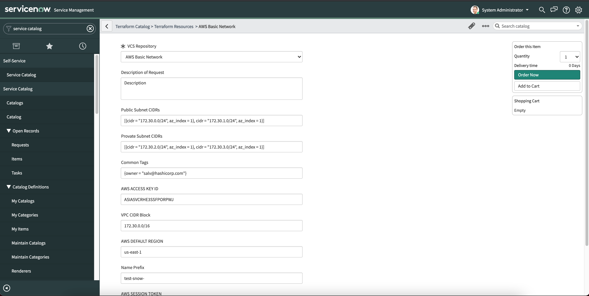

After ordering the Catalog Item, to determine whether the request was successful you should go to Terraform Cloud and check if a workspace was created, variables were set for it and a run was triggered.

Even if the run itself fails it may be due to issues not related to the Terraform ServiceNOW application but for example due to providing invalid credentials.

### Clean UP

If a successful Terraform run was performed and resources were created in AWS do not forget to clean them up. You can do that by queueing a destroy run for the workspace directly in Terraform Cloud or can use the `Delete Workspace Flow` catalog item in ServiceNOW.